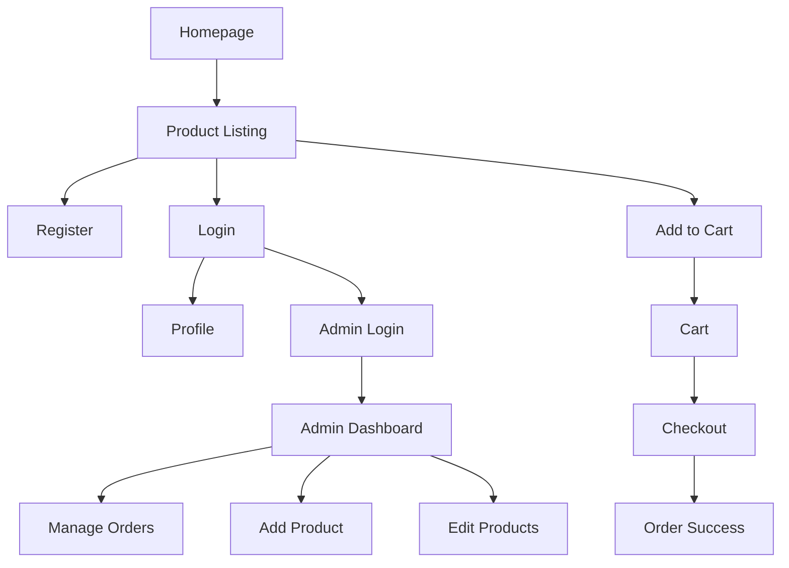

# Clothing Shop Project PRD

## 1. Overview
This document outlines the Product Requirements for the Clothing Shop web application, including user flows and database structure.

## 2. User Flow



## 3. Database Structure

### Users (users.json)
```json
[
  {
    "id": 1,
    "username": "johndoe",
    "email": "john@example.com",
    "password_hash": "...",
    "profile": {
      "name": "John Doe",
      "address": "123 Main St",
      "phone": "123-456-7890"
    }
  }
]
```

### Products (products.xml)
```xml
<products>
  <product>
    <id>1</id>
    <name>T-Shirt</name>
    <price>19.99</price>
    <description>Comfortable cotton t-shirt</description>
    <image>tshirt.jpg</image>
    <stock>50</stock>
  </product>
</products>
```

### Orders (orders.json)
```json
[
  {
    "order_id": 1001,
    "user_id": 1,
    "items": [
      { "product_id": 1, "quantity": 2 }
    ],
    "total": 39.98,
    "date": "2025-07-13",
    "status": "Completed"
  }
]
```

## 4. Admin Functions
- View/manage orders
- Add/edit/delete products
- View dashboard stats
